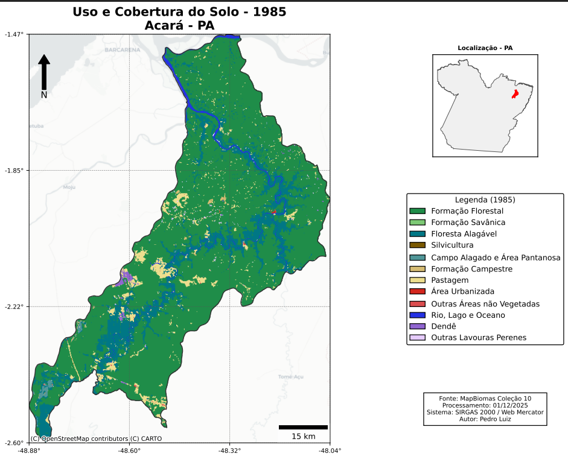
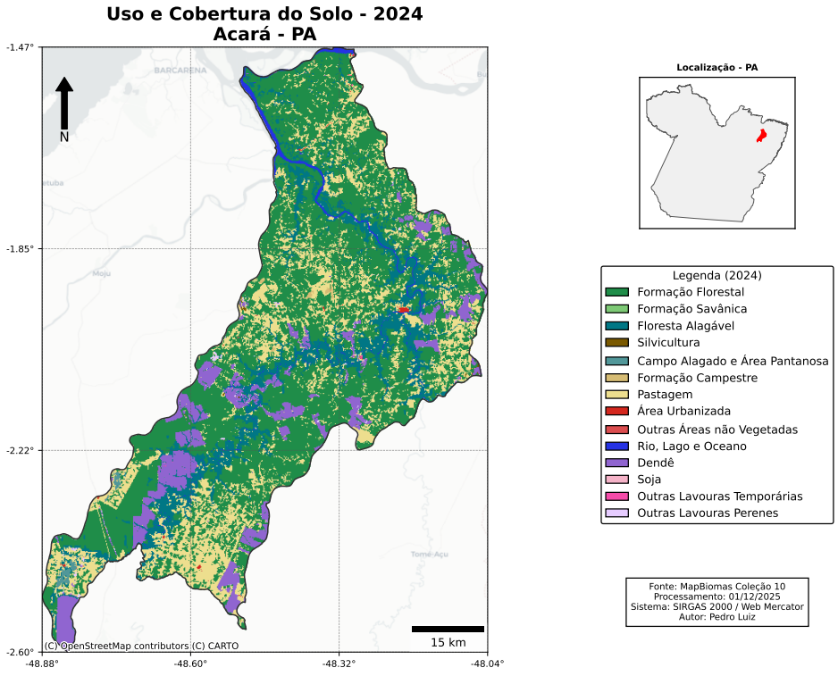
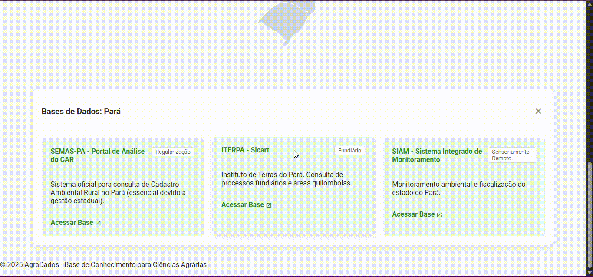
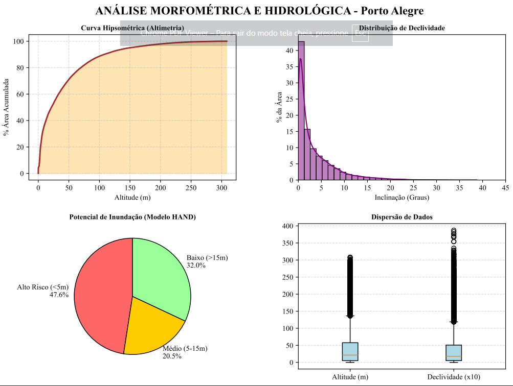
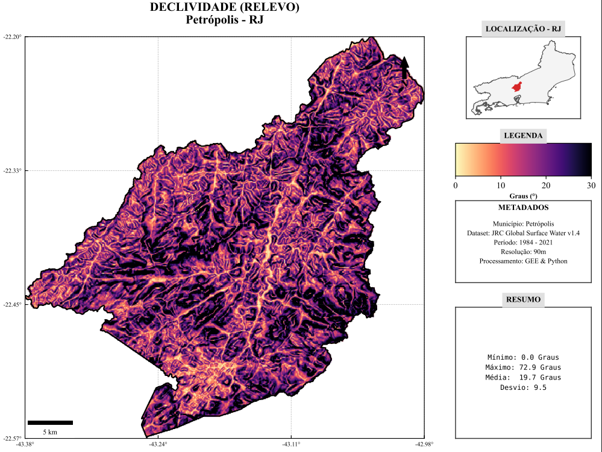
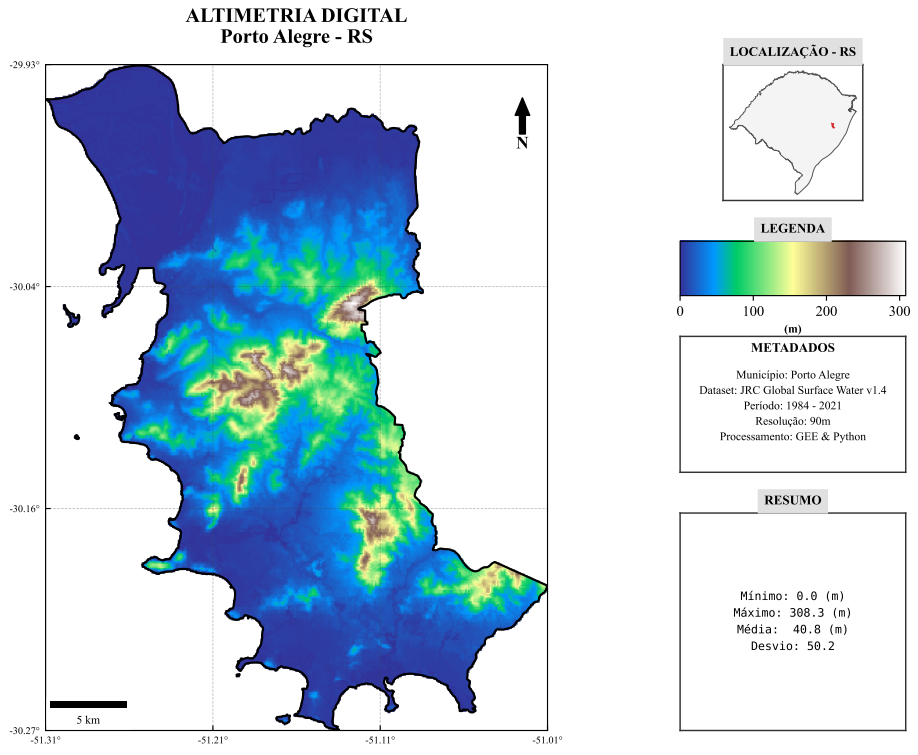
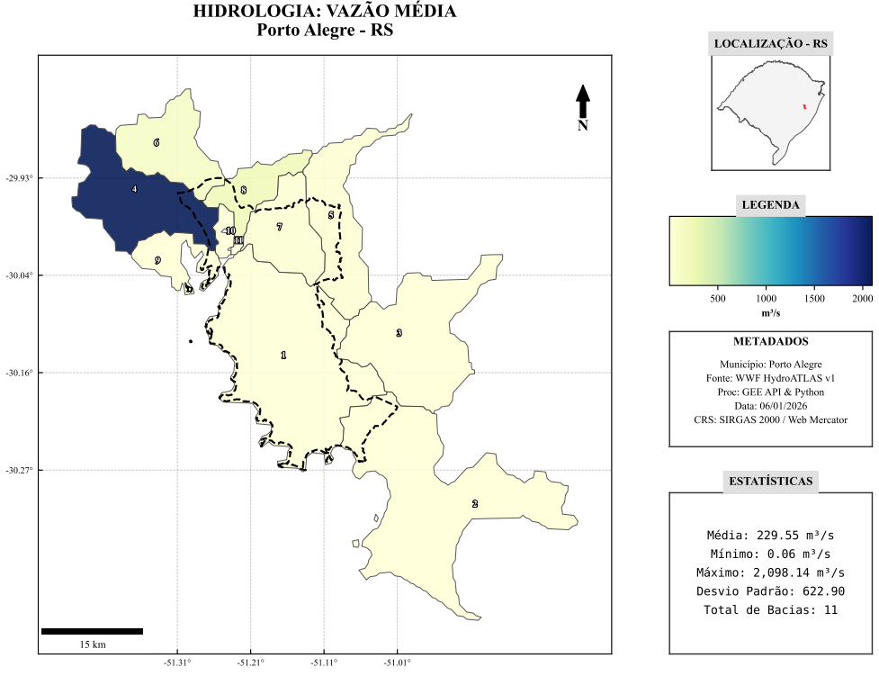

  
  
  

---

### &nbsp; Sobre mim

Sou **Engenheiro Florestal** e **Cientista de Dados Geoespaciais**, apaixonado por unir a gestão de recursos naturais à engenharia de dados. Meu foco é resolver problemas operacionais complexos através da automação.

Possuo experiência prática na transformação de fluxos manuais em pipelines escaláveis, reduzindo o tempo de processamento de **dias para minutos**. Domino o ecossistema **Python GIS** e processamento em nuvem com **Google Earth Engine**, entregando soluções de alta precisão para o setor agroflorestal e de sustentabilidade.

---

### &nbsp; Fatos Rápidos
- 🎓 **Formação:** Engenheiro Florestal pela UFSJ (2025).
- 🧠 **Foco:** Automação de Pipelines, ETL Geoespacial e Cloud Computing.
- 🛠️ **Stack Principal:** Python, PostGIS, Google Earth Engine e Streamlit.
- 💡 **Missão:** Criar arquiteturas que democratizem o acesso à inteligência geográfica.

---

### &nbsp;🛠️ Arsenal Tecnológico

**Linguagens & Core** 

**Geoespacial & Cloud** 

**Bibliotecas & Frameworks** 

**Ferramentas & DevOps** 

---

## &nbsp; Projetos em Destaque

### 1. [GeoPython Assistant: O Mentor de IA para Inteligência Geoespacial](https://github.com/PedroLuizskt/GeoPython-Assistant)
> *AI & EdTech | Python, Streamlit, LLM (Llama-3)*

O **GeoPython Assistant** resolve a desconexão entre tutoriais genéricos de programação e a realidade dos dados espaciais. Utilizando **Engenharia de Prompt avançada** e a API da Groq (Llama-3-70b), criei um "Arquiteto Sênior" virtual que traduz dúvidas de código diretamente para o contexto GIS (FeatureCollections, Rasters, Otimização).

* **Destaque:** Sistema Anti-Alucinação que prioriza bibliotecas oficiais e otimização de performance para Big Data.

  

---

### 2. [Geospatial Automation Suite](https://github.com/PedroLuizskt/Geospatial-Automation-Suite)
> *Python ETL | Google Earth Engine | Automação de Processos*

Uma suíte de pipelines que transforma a geração de relatórios técnicos de dias para minutos. Integra processamento local (GeoPandas) para dados vetoriais sensíveis (CAR, Reserva Legal) e processamento em nuvem (GEE) para análises em escala planetária (MapBiomas, Declividade NASADEM).

* **Impacto:** Gera dossiês em PDF profissionais automaticamente, com cálculo de déficit de reserva legal e mapas temáticos prontos.

  <table>
    <tr>
      <td align="center"><b>Uso do Solo - 1985 (Acará/PA)</b></td>
      <td align="center"><b>Uso do Solo - 2024 (Acará/PA)</b></td>
    </tr>
    <tr>
      <td></td>
      <td></td>
    </tr>
  </table>

---

### 3. [AgroDados: Hub de Inteligência Geoespacial](https://github.com/PedroLuizskt/agrodados)
> *WebGIS | JavaScript | SVG Interativo | Frontend Puro*

Plataforma desenvolvida para resolver a fragmentação de dados ambientais e fundiários no Brasil. Atua como um "One-Stop-Shop" conectando o usuário a bases oficiais (MapBiomas, SICAR, IDEs Estaduais) através de um mapa interativo SVG.

* **Engenharia:** Desenvolvido sem backend pesado, focado em performance e usabilidade (UX) para profissionais de campo.

  

---

### 4. [Brazil Hydro Dynamics](https://github.com/PedroLuizskt/brazil-hydro-dynamics)
> *Ciência de Dados | Jupyter Notebooks | Hidrologia | GEE*

Módulos analíticos científicos para análise de dinâmica hídrica e risco de inundação. Utiliza dados do JRC Global Surface Water, HydroATLAS e MERIT Hydro para modelar microbacias e calcular índices críticos como o HAND (Height Above Nearest Drainage).

  <table>
    <tr>
      <td width="50%"></td>
      <td width="50%"></td>
    </tr>
    <tr>
      <td width="50%"></td>
      <td width="50%"></td>
    </tr>
  </table>

---

## &nbsp;📈 Atividade no GitHub

  

---

## &nbsp;📫 Conecte-se Comigo

Estou sempre aberto a conversar sobre tecnologia, florestas e dados.

  
  
  

 

  <i>"Transformando conceitos de programação em soluções de Geoprocessamento."</i>

  

