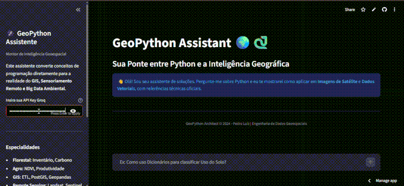
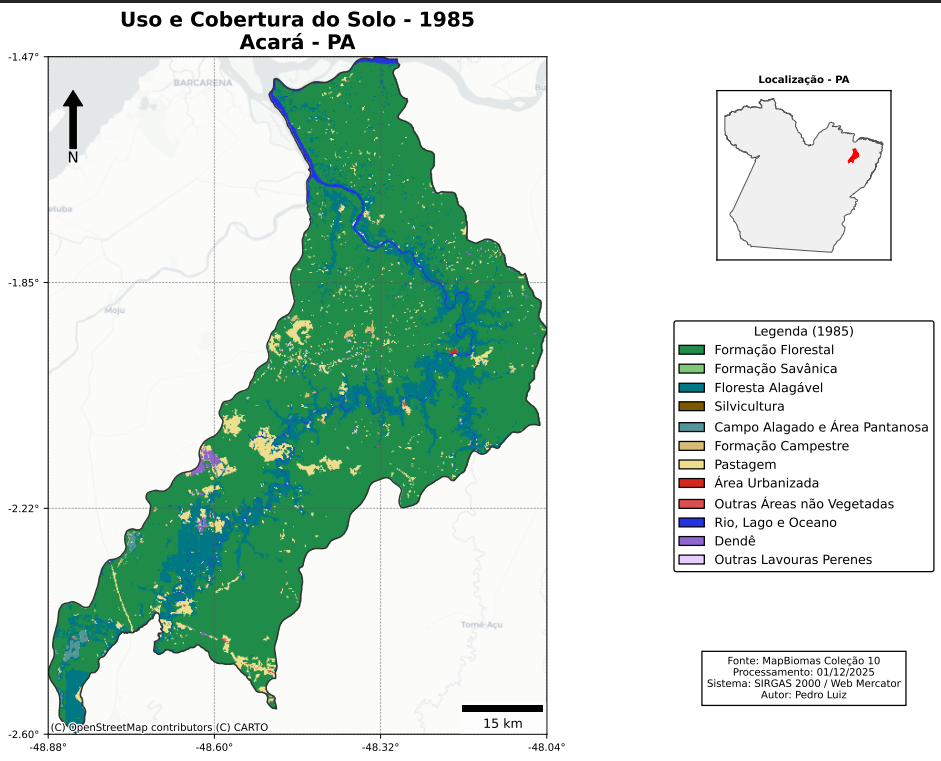
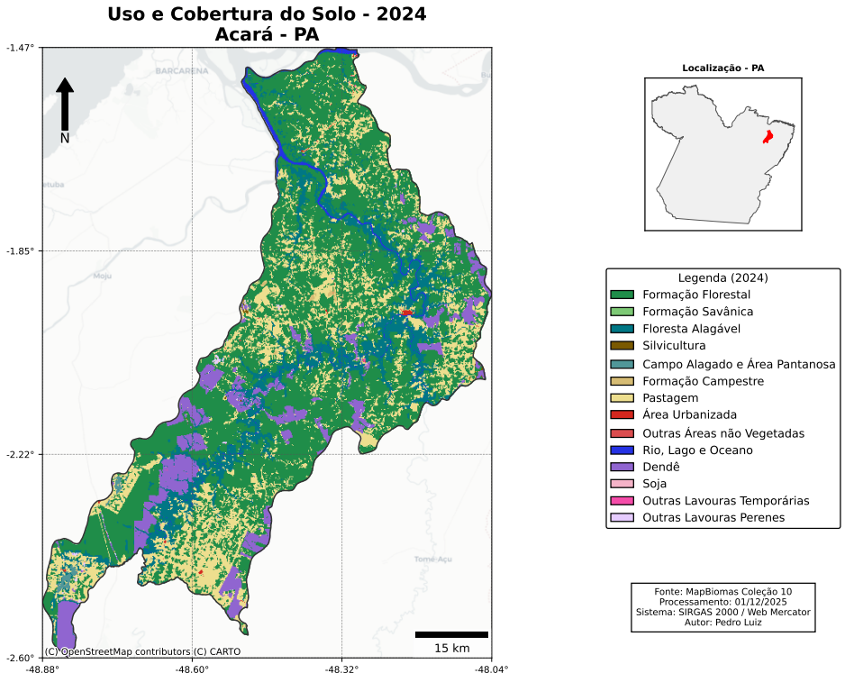
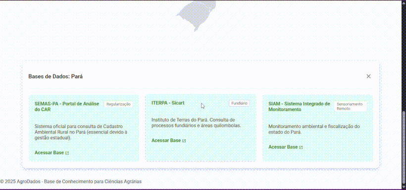
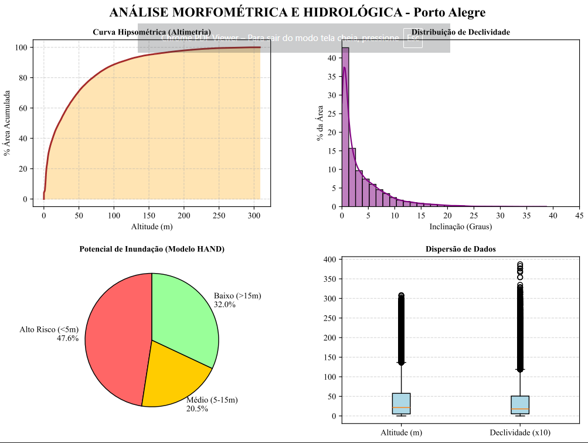
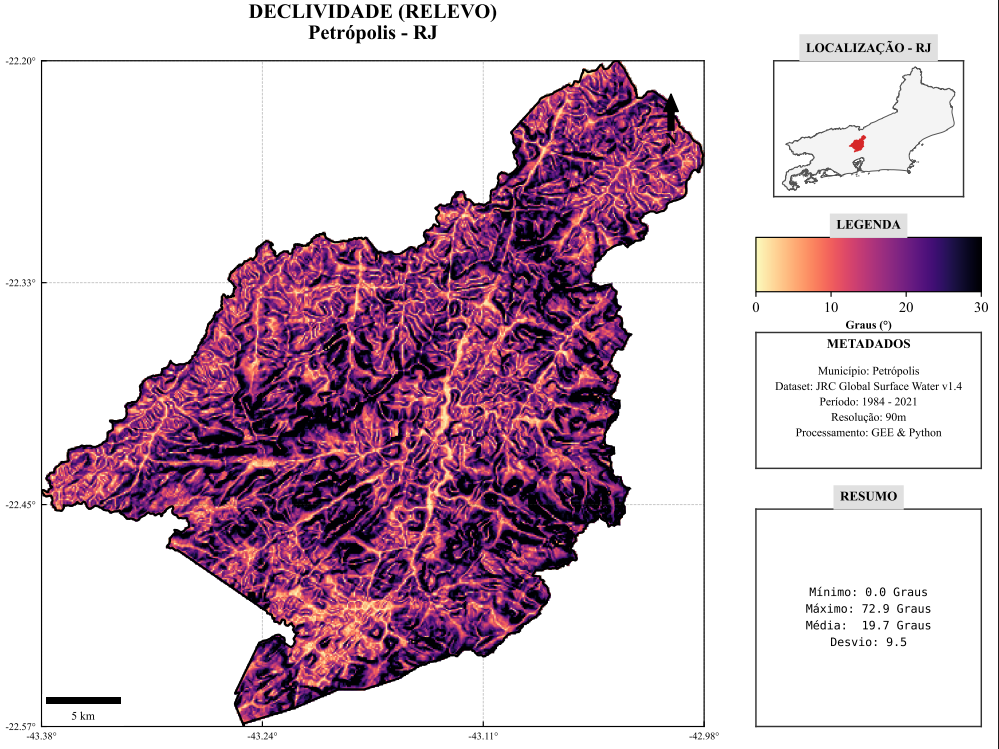
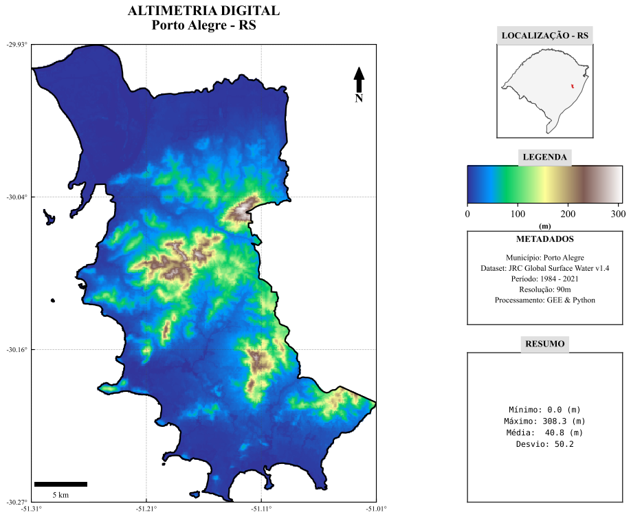
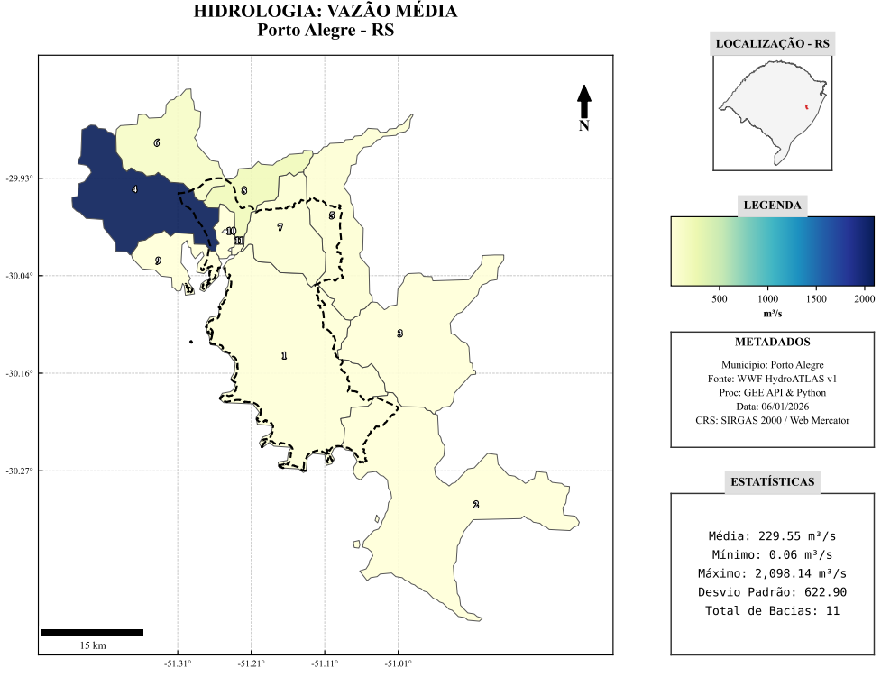

  
  
  

### 🌲 Sobre mim

Sou **Engenheiro Florestal** e **Cientista de Dados Geoespaciais**, com uma base sólida em **Engenharia de Software**. Meu diferencial está em unir a inteligência territorial à construção de arquiteturas de dados de alta performance.

Especialista em automatizar pipelines complexos (ETL) e desenvolver soluções de **Back-end (Node.js/TypeScript)**, foco em transformar fluxos manuais em sistemas escaláveis. Consigo levar o processamento de dados ambientais de **dias para minutos**, garantindo que a informação chegue de forma segura e rápida via **APIs RESTful**.

---

### Fatos Rápidos
- **Formação:** Engenheiro Florestal pela UFSJ (2025).
- **Engenharia de Dados:** Especialista em Python (GeoPandas, Rasterio) e Google Earth Engine.
- **Software & Cloud:** Experiência em Clean Architecture, Node.js, TypeScript e PostGIS.
- **Inovação:** Criador de assistentes virtuais baseados em LLMs (Llama-3) para o setor agroflorestal.
- **Missão:** Democratizar o acesso à inteligência geográfica através de tecnologia robusta.

---

### Arsenal Tecnológico & Arquitetura

**Linguagens de Programação** 

**Engenharia de Dados, Backend & APIs** 

**Infraestrutura Geoespacial & Cloud** 

**Processamento de Dados (Vetorial/Matricial)** 

**Inteligência Artificial & Analytics** 

**Visualização & Dashboards** 

**DevOps & Ferramentas** 

---

## &nbsp; Projetos em Destaque

### 1. [GeoPython Assistant: O Mentor de IA para Inteligência Geoespacial](https://github.com/PedroLuizskt/GeoPython-Assistant)
> *AI & EdTech | Python, Streamlit, LLM (Llama-3)*

O **GeoPython Assistant** resolve a desconexão entre tutoriais genéricos de programação e a realidade dos dados espaciais. Utilizando **Engenharia de Prompt avançada** e a API da Groq (Llama-3-70b), criei um "Arquiteto Sênior" virtual que traduz dúvidas de código diretamente para o contexto GIS (FeatureCollections, Rasters, Otimização).

* **Destaque:** Sistema Anti-Alucinação que prioriza bibliotecas oficiais e otimização de performance para Big Data.

  

---

### 2. [Geospatial Automation Suite](https://github.com/PedroLuizskt/Geospatial-Automation-Suite)
> *Python ETL | Google Earth Engine | Automação de Processos*

Uma suíte de pipelines que transforma a geração de relatórios técnicos de dias para minutos. Integra processamento local (GeoPandas) para dados vetoriais sensíveis (CAR, Reserva Legal) e processamento em nuvem (GEE) para análises em escala planetária (MapBiomas, Declividade NASADEM).

* **Impacto:** Gera dossiês em PDF profissionais automaticamente, com cálculo de déficit de reserva legal e mapas temáticos prontos.

  <table>
    <tr>
      <td align="center"><b>Uso do Solo - 1985 (Acará/PA)</b></td>
      <td align="center"><b>Uso do Solo - 2024 (Acará/PA)</b></td>
    </tr>
    <tr>
      <td></td>
      <td></td>
    </tr>
  </table>

---

### 3. [AgroDados: Hub de Inteligência Geoespacial](https://github.com/PedroLuizskt/agrodados)
> *WebGIS | JavaScript | SVG Interativo | Frontend Puro*

Plataforma desenvolvida para resolver a fragmentação de dados ambientais e fundiários no Brasil. Atua como um "One-Stop-Shop" conectando o usuário a bases oficiais (MapBiomas, SICAR, IDEs Estaduais) através de um mapa interativo SVG.

* **Engenharia:** Desenvolvido sem backend pesado, focado em performance e usabilidade (UX) para profissionais de campo.

  

---

### 4. [Brazil Hydro Dynamics](https://github.com/PedroLuizskt/brazil-hydro-dynamics)
> *Ciência de Dados | Jupyter Notebooks | Hidrologia | GEE*

Módulos analíticos científicos para análise de dinâmica hídrica e risco de inundação. Utiliza dados do JRC Global Surface Water, HydroATLAS e MERIT Hydro para modelar microbacias e calcular índices críticos como o HAND (Height Above Nearest Drainage).

  <table>
    <tr>
      <td width="50%"></td>
      <td width="50%"></td>
    </tr>
    <tr>
      <td width="50%"></td>
      <td width="50%"></td>
    </tr>
  </table>

---

## &nbsp;📈 Atividade no GitHub

  

---

## &nbsp;📫 Conecte-se Comigo

Estou sempre aberto a conversar sobre tecnologia, florestas e dados.

  
  
  

 

  <i>"Transformando conceitos de programação em soluções de Geoprocessamento."</i>

  

