<!-- ==========================================================================
     PERFIL GITHUB - Pedro Luiz R. Vaz de Melo
     Estetica: "Geospatial dark editorial"
     Capas e banner auto-hospedados em ./assets (PNG proprios). Badges
     tecnologicos via shields.io somente nas secoes de stack. Sem emojis.
     Numeros apenas de fatos reais.
     Manutencao:
       - o camo do GitHub cacheia por URL: ao trocar uma capa, use nome NOVO.
       - toda imagem precisa de alt significativo em PT-BR.
       - as capas dos projetos vivem neste repo (assets/), nunca nos repos-alvo.
     ========================================================================== -->

  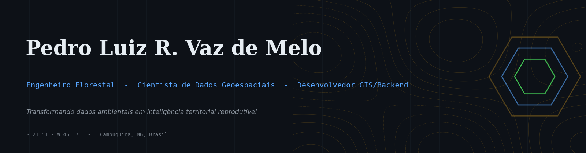

**Uno inteligência territorial e ciência de dados a arquiteturas de back-end de alta performance.**
**Transformo dados ambientais brutos em produtos reprodutíveis: pipelines que levam de dias para minutos, servidos como WebMaps, dashboards e APIs.**

 

 Cambuquira, MG, Brasil - trabalho remoto

---

## Sobre

Sou **Engenheiro Florestal** (UFSJ, 2025) e **Cientista de Dados Geoespaciais**, com base sólida em **desenvolvimento back-end**. Meu diferencial está em unir três exigências que raramente convivem no mesmo profissional: **rigor científico**, **performance de produção** e **clareza para quem toma a decisão**.

Na prática, automatizo pipelines complexos de dados ambientais com **Python** (GeoPandas, Rasterio, PyArrow) e **Google Earth Engine**, sirvo os resultados por **APIs RESTful** em **Node.js/TypeScript** ou **FastAPI**, e materializo tudo em **WebMaps e dashboards interativos** que substituem PDFs estáticos por evidência navegável. Fluxos que antes exigiam dias de trabalho manual passaram a levar minutos, com produtos versionados, testados e auditáveis.

- **Atualmente:** Cientista de Dados na **EnvironBIT** (projeto CNPq) e consultor de Geoprocessamento e Desenvolvimento GIS para **linhas de transmissão** e **projetos de compensação ambiental** na **Vimef Engenharia**.
- **Formação continuada:** Pós-graduação em **Ciência de Dados** (Data Science Academy).
- **Foco técnico:** ETL geoespacial, sensoriamento remoto, machine learning aplicado ao setor florestal, WebGIS e APIs.
- **Missão:** democratizar o acesso à inteligência geográfica através de tecnologia robusta e reprodutível.

---

## Arsenal Tecnológico

**Linguagens** 

**Geotecnologias e Cloud** 

**Back-end e APIs** 
 

**Ciência de Dados e IA** 

**Visualização, BI e Observabilidade** 

**DevOps e Ferramentas** 

---

## Projetos em Destaque

Cada projeto abaixo é reprodutível do dado bruto ao produto final. Os números não são folheto: os repositórios trazem os testes, os notebooks e os dados.

 

### Ciência de Dados Geoespacial e Clima

---

#### [ENSO Centro-Oeste](https://github.com/PedroLuizskt/enso-centro-oeste)
> *Teleconexão climática municipal - Python, Google Earth Engine, NOAA/CPC, estatística espacial*

<a href="https://github.com/PedroLuizskt/enso-centro-oeste">
  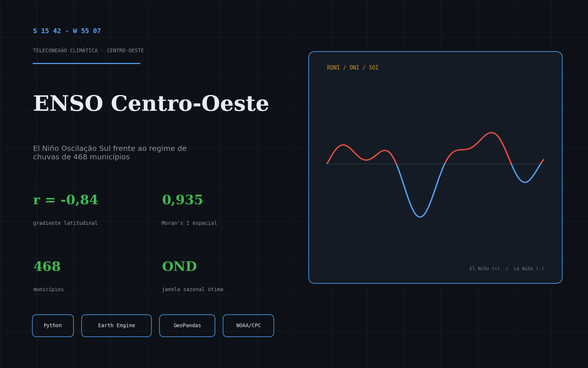
</a>

Pacote Python instalável (`enso_co`) que quantifica a teleconexão entre o **El Niño Oscilação Sul** e o regime climático do **Centro-Oeste brasileiro** (MT, MS, GO, DF) no nível de **468 municípios**. Cruza três índices oficiais da NOAA/CPC (RONI, ONI e SOI) com precipitação (CHIRPS) e temperatura (ERA5-Land) via Google Earth Engine, aplicando correção de autocorrelação de Bretherton, testes de permutação circular e Moran's I. A saída final é um **dashboard WebMap autônomo** que funciona offline.

- **Resultado principal:** gradiente latitudinal robusto (r entre -0,836 e -0,849, Moran's I acima de 0,93), polo negativo forte no norte do Mato Grosso e janela sazonal OND identificada empiricamente.
- **Diferencial:** todos os dados são obtidos programaticamente (sem download manual); adota o RONI como índice primário, seguindo a NOAA desde fevereiro de 2026.

 

#### [Florestas Públicas do Brasil](https://github.com/PedroLuizskt/florestas-publicas-brasil)
> *WebGIS e análise fundiária - Python, GeoPandas, Leaflet.js, GitHub Pages*

<a href="https://pedroluizskt.github.io/florestas-publicas-brasil/">
  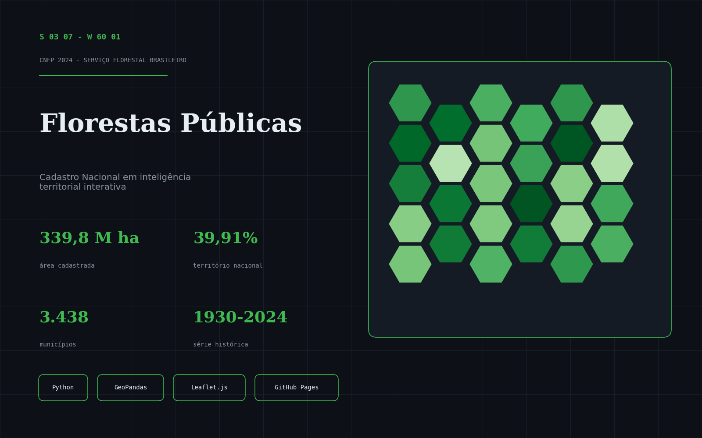
</a>

Análise geoespacial completa do **Cadastro Nacional de Florestas Públicas (CNFP 2024)** do Serviço Florestal Brasileiro, cruzada com os limites municipais e estaduais do IBGE 2024. O WebMap publicado no GitHub Pages permite explorar **339,8 milhões de hectares** (39,91% do território brasileiro) em quatro abas: visão geral, ranking municipal, série histórica (1930-2024) e recorte por bioma.

**[Acessar o WebMap ao vivo](https://pedroluizskt.github.io/florestas-publicas-brasil/)**

 

#### [Brazil Hydro Dynamics](https://github.com/PedroLuizskt/brazil-hydro-dynamics)
> *Inteligência hidrológica - Python, Google Earth Engine, OOP*

<a href="https://github.com/PedroLuizskt/brazil-hydro-dynamics">
  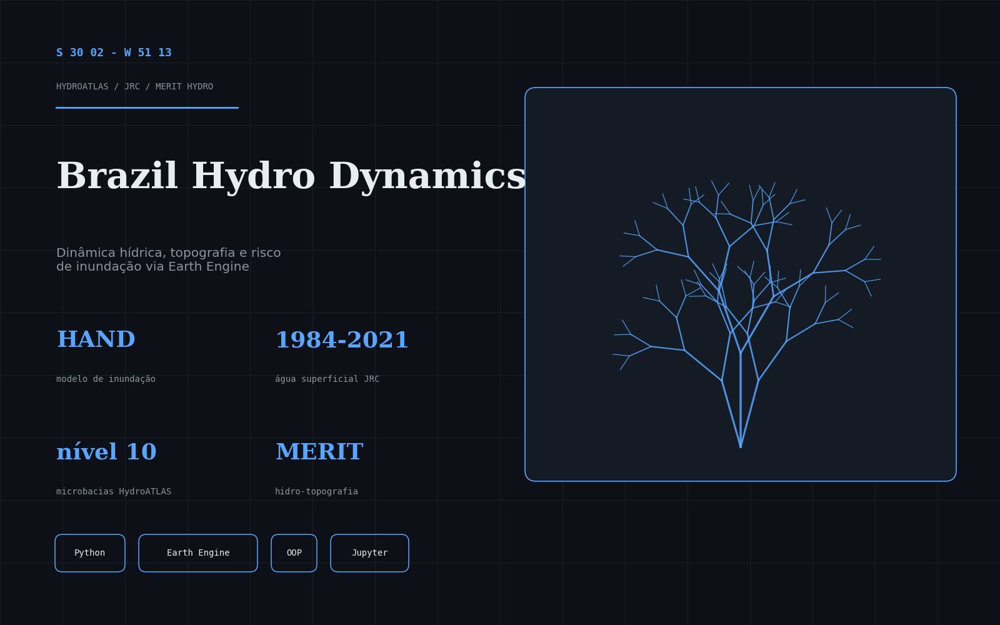
</a>

Suíte de pipelines Python de alta performance para análise de **dinâmica hídrica, topografia e água superficial** de municípios brasileiros, com arquitetura orientada a objetos. Três módulos analíticos: microbacias nível 10 (HydroATLAS), transições de água superficial ao longo de quase 40 anos (JRC), e hidro-topografia com o índice **HAND** (Height Above Nearest Drainage) para mapeamento de risco de inundação (MERIT Hydro).

<table>
  <tr>
    <td width="50%"></td>
    <td width="50%"></td>
  </tr>
  <tr>
    <td width="50%"></td>
    <td width="50%"></td>
  </tr>
</table>

 

#### [Monitoramento de Eventos Climáticos Extremos (WebGIS)](https://github.com/PedroLuizskt/gee-precipitation-webmap-mg)
> *ETL geoespacial serverless - Python, Google Earth Engine, Leaflet.js*

<a href="https://github.com/PedroLuizskt/gee-precipitation-webmap-mg">
  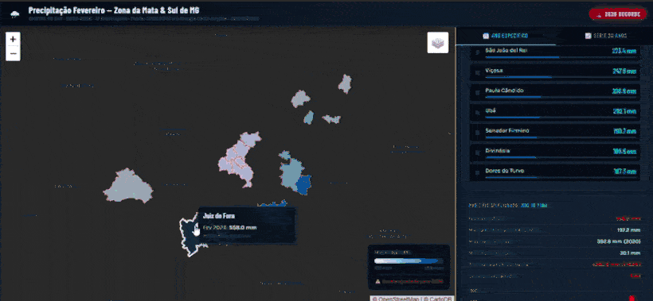
</a>

Pipeline ETL geoespacial que monitora **anomalias pluviométricas extremas**. Extrai e processa duas décadas de dados raster de satélite (CHIRPS) via Google Earth Engine, calcula estatísticas espaciais na nuvem e injeta os dados de forma assíncrona em um WebMap interativo serverless. O sistema quantificou rigorosamente a **catástrofe climática de fevereiro de 2026 em Minas Gerais**, sem necessidade de infraestrutura de back-end.

 

### Machine Learning e Engenharia Florestal

---

#### [Forest-Py](https://github.com/PedroLuizskt/forest-py-estudos)
> *Deep Learning aplicado - Python, PyTorch, scikit-learn, pytest*

<a href="https://github.com/PedroLuizskt/forest-py-estudos">
  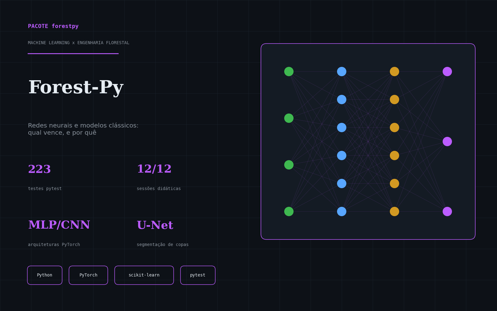
</a>

Pacote Python instalável (`forestpy`) que aplica com rigor **redes neurais e machine learning** aos desafios clássicos da Engenharia Florestal: dendrometria, inventário e sensoriamento remoto, até a segmentação semântica de copas de árvores com **U-Net**. Estruturado em **12 sessões didáticas** com mais de **223 testes automatizados**.

- **Tese central, demonstrada empiricamente:** nenhum paradigma é universalmente superior. Modelos clássicos vencem com a forma funcional correta ou dados escassos; redes neurais vencem com features mais ricas ou saída espacialmente densa. O profissional sênior diagnostica o regime antes de escolher a ferramenta.

 

#### [Silvicultura Brasileira: Análise e Machine Learning](https://github.com/PedroLuizskt/analise-silvicultura-brasileira)
> *Data Science ponta a ponta - Python, scikit-learn, Plotly, API SIDRA (IBGE)*

<a href="https://github.com/PedroLuizskt/analise-silvicultura-brasileira">
  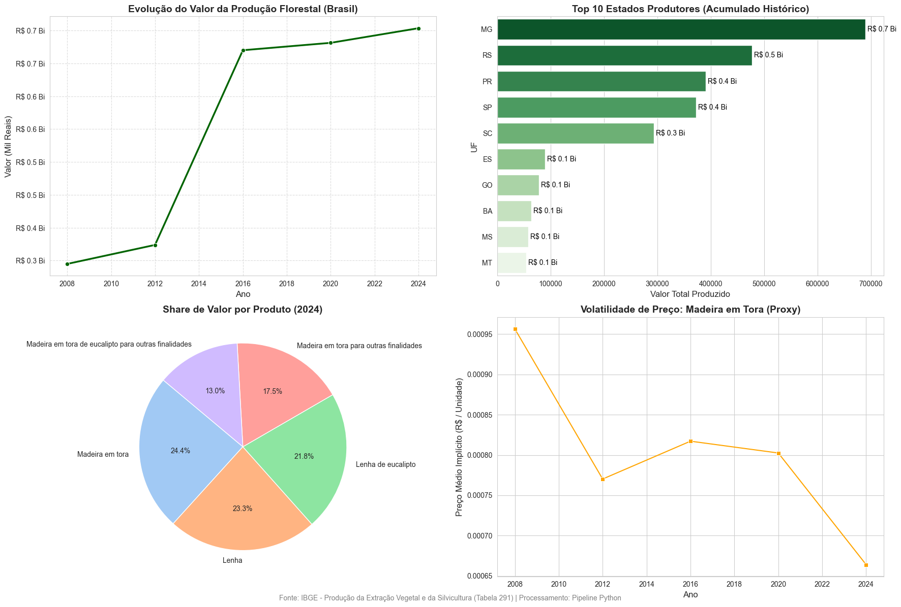
</a>

Pipeline de ciência de dados ponta a ponta focado no mercado florestal brasileiro. Realiza extração e tratamento avançado de dados socioeconômicos via API oficial do IBGE (SIDRA) e aplica **clustering K-Means** para segmentação estratégica de municípios, com Método do Cotovelo para otimização e visualizações interativas em Plotly para suporte à decisão.

---

### Inteligência Artificial, WebGIS e Automação

---

#### [GeoPython Assistant v2](https://github.com/PedroLuizskt/GeoPython-Assistant-v2)
> *RAG aplicada a Geociências - Python, Streamlit, LangChain, Pydantic v2, Chroma*

<a href="https://github.com/PedroLuizskt/GeoPython-Assistant-v2">
  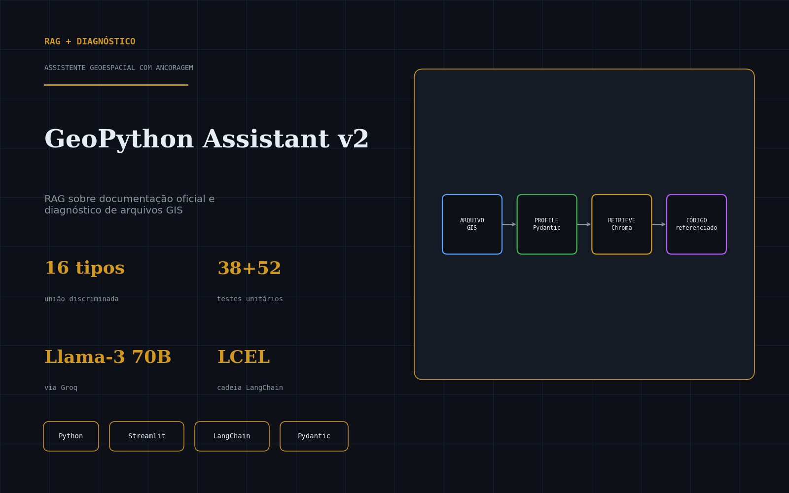
</a>

Evolução substancial do assistente original. Combina **Retrieval-Augmented Generation (RAG) dupla**: um pipeline de diagnóstico estruturado sobre arquivos geoespaciais fornecidos pelo usuário (profiling vetorial e matricial validado por Pydantic v2) e um pipeline de recuperação de trechos relevantes da documentação oficial das principais bibliotecas Python do ecossistema geoespacial. A arquitetura mitiga a alucinação de API e condiciona as sugestões de código às características reais do dado submetido.

> A **versão 1** deste assistente, focada em engenharia de prompt sobre o Llama-3 70B, está publicada e navegável: **[demo ao vivo no Streamlit](https://geopython-assistant-skt.streamlit.app/)**.

  

 

#### [AgroDados: Hub de Inteligência Geoespacial](https://github.com/PedroLuizskt/agrodados-webgis)
> *WebGIS - JavaScript, HTML, CSS, Leaflet.js, WMS/GeoJSON*

Plataforma WebGIS responsiva que resolve a **fragmentação de dados ambientais e fundiários** no Brasil. Atua como um ponto único de acesso, conectando o usuário a bases oficiais (CAR/SICAR, MapBiomas, ZEE, IDEs estaduais) através de um mapa interativo. Desenvolvido com foco em performance e usabilidade para profissionais de campo, consumindo camadas WMS/GeoJSON sem back-end pesado.

 

#### [Geospatial Automation Suite](https://github.com/PedroLuizskt/Geospatial-Automation-Suite)
> *ETL geoespacial - Python, GeoPandas, Rasterio, Google Earth Engine*

Suíte de pipelines que transforma a geração de relatórios técnicos de **dias em minutos**. Integra processamento local (GeoPandas) para dados vetoriais sensíveis (CAR, Reserva Legal, APP) e processamento em nuvem (Google Earth Engine) para análises em escala nacional (MapBiomas, declividade NASADEM, carbono do solo). Gera dossiês em PDF profissionais automaticamente, com cálculo de déficit de Reserva Legal, análise multitemporal (1985-2024) e mapas temáticos prontos.

---

### Engenharia de Software, Back-end e Business Intelligence

---

#### [Data Analytics and Business Intelligence Portfolio](https://github.com/PedroLuizskt/data-analytics-portfolio)
> *Machine Learning e BI - R, Python, Power BI, DAX, SQL*

<a href="https://github.com/PedroLuizskt/data-analytics-portfolio">
  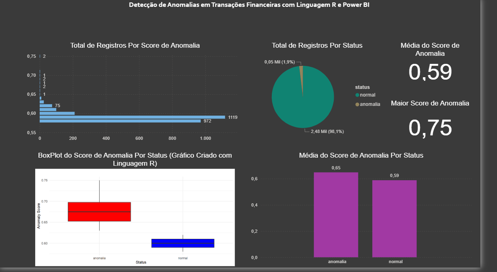
</a>

Suíte de soluções analíticas focada em modelagem dimensional (Star Schema) e pipelines ETL para finanças, marketing e logística. O destaque é a integração de algoritmos preditivos diretamente na camada de visualização: um sistema autônomo de **detecção de fraudes financeiras** com o algoritmo **Isolation Forest** em R, integrado ao Power BI, entregando um dashboard executivo que direciona a auditoria para as transações anômalas.

 

#### [FastAPI Task Manager](https://github.com/PedroLuizskt/fastapi-task-manager)
> *Back-end type-safe - Python, FastAPI, SQLModel, pytest*

<a href="https://github.com/PedroLuizskt/fastapi-task-manager">
  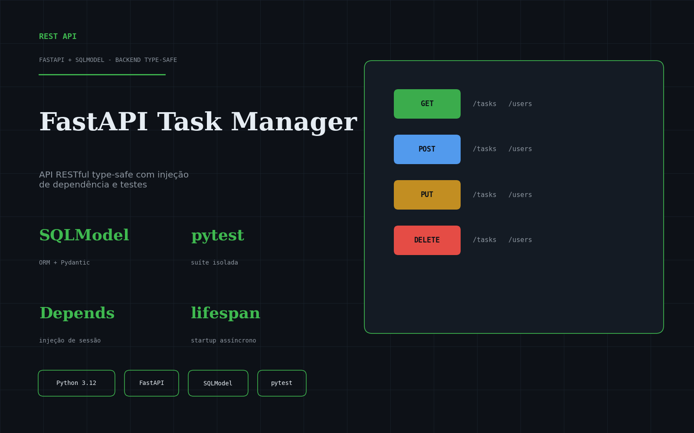
</a>

API RESTful moderna e **type-safe** construída com FastAPI e SQLModel. Implementa CRUD robusto, injeção de dependência via `Depends` (uma sessão de banco por requisição), eventos assíncronos de `lifespan` e uma suíte completa de testes com `pytest` sobre banco SQLite em memória isolado (`StaticPool`). Demonstra a integração entre SQLAlchemy (ORM) e Pydantic (validação) em sintaxe única.

 

#### [Estudos de Observabilidade](https://github.com/PedroLuizskt/estudos-observabilidade)
> *Observabilidade moderna - Python, OpenTelemetry, Grafana LGTM stack*

<a href="https://github.com/PedroLuizskt/estudos-observabilidade">
  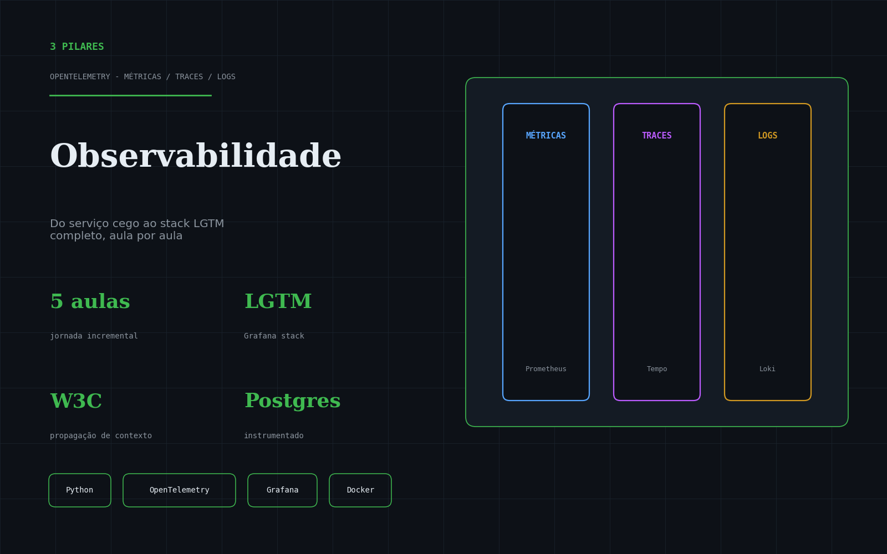
</a>

Jornada incremental pelo ecossistema de **observabilidade moderna** em Python. Partindo de uma aplicação propositalmente sem instrumentação, cada aula adiciona um pilar: **métricas** (OpenTelemetry + Prometheus), **tracing distribuído** (Tempo, com propagação de contexto W3C), **logs estruturados** correlacionados (Loki) e persistência PostgreSQL instrumentada, tudo sobre o stack Grafana LGTM. Documenta tanto a evolução do código quanto a evolução do raciocínio.

 

#### [RESTful WebAPI sem Frameworks](https://github.com/PedroLuizskt/node-ts-webapi-without-frameworks-podcast-manager)
> *Back-end puro - Node.js, TypeScript, Clean Architecture*

Para demonstrar domínio dos fundamentos HTTP e de engenharia de software, desenvolvi esta API RESTful do zero, **sem frameworks** (sem Express ou NestJS). Estruturada sob o padrão MSC (Model-Service-Controller), implementa roteamento nativo, injeção autônoma de cabeçalhos CORS de segurança, tratamento universal de exceções (fallback 404) e higienização rigorosa de inputs.

---

## Estatísticas do GitHub

  
  

  

---

## Contato

Estou sempre aberto a conversar sobre tecnologia, florestas e dados.

  
<i>"Transformando conceitos de programação em soluções de Geoprocessamento."</i>

